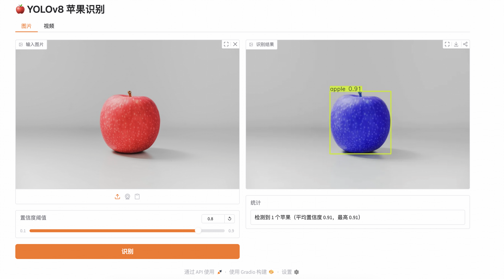
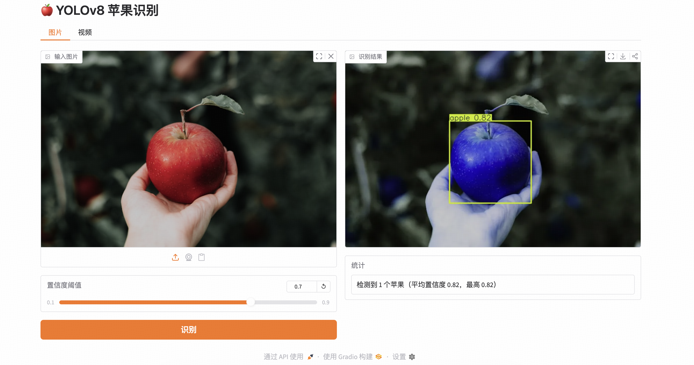
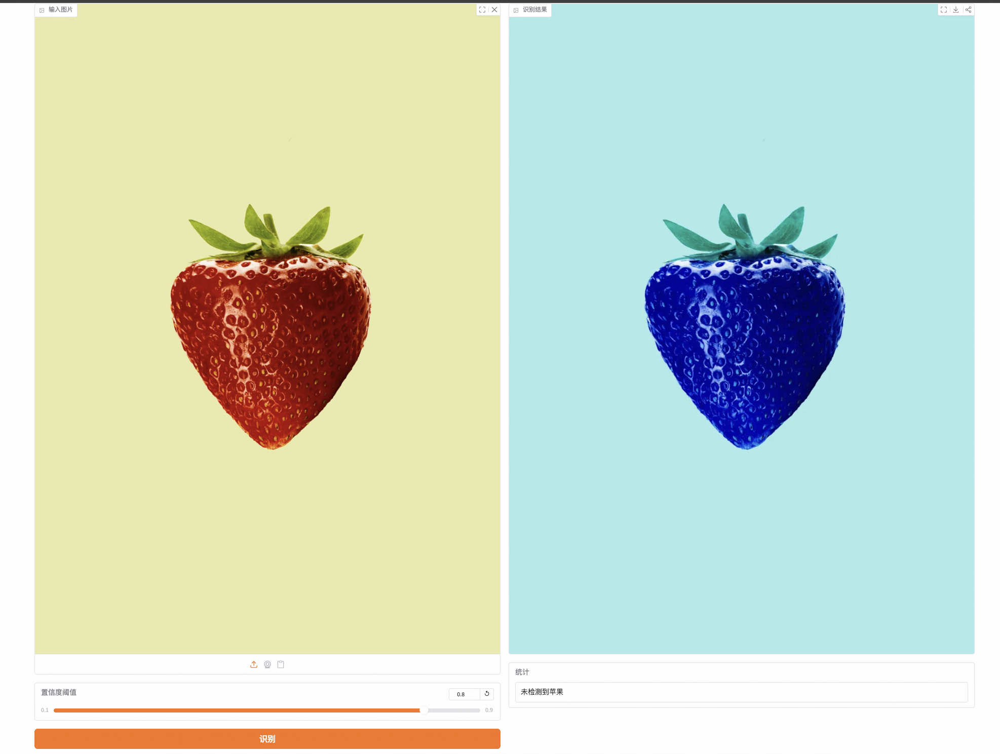
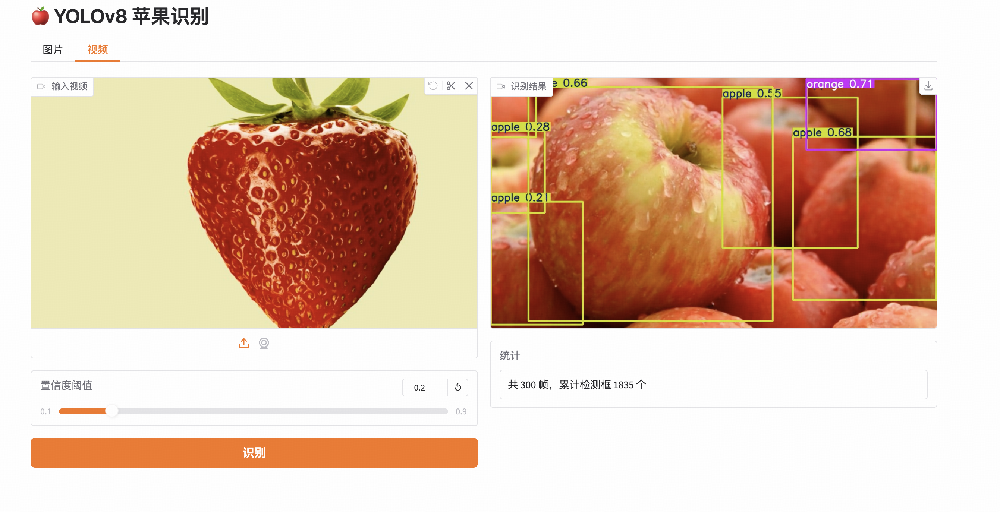

# 🍎 YOLOv8 苹果识别系统

基于 [Ultralytics YOLOv8](https://github.com/ultralytics/ultralytics) 的轻量苹果目标识别系统，提供 **CLI 推理 / 训练 / Gradio Web 界面** 三种使用方式，开箱即用。

未训练自有模型时，自动回退到 COCO 预训练权重 `yolov8n.pt`（其中已包含 `apple` 类别），下载完即可识别。

---

## ✨ 功能特性

- 🖼️ **图片识别**：拖拽即识别，标注边界框并输出数量、平均/最高置信度
- 🎞️ **视频识别**：逐帧检测，返回带框视频和累计目标数
- 📷 **摄像头/CLI**：`detect.py 0` 实时摄像头，`detect.py path/to/img.jpg` 批量识别
- 🏋️ **一键训练**：`train.py` 50 epoch 默认配置，准备好数据集即可启动
- 🌐 **Gradio Web UI**：`app.py` 一行命令在浏览器启动
- 🪶 **极简依赖**：仅需 ultralytics + opencv + gradio

---

## 🖼️ 运行效果

### 单目标识别（理想环境）

<p align="center"></p>

> 纯背景下单苹果，置信度 **0.91**，边界框精准贴合果实。

### 复杂背景（手持 + 树林背景）

<p align="center"></p>

> 部分手指遮挡、背景虚化树林，仍准确识别，置信度 **0.82**。

### 负样本测试（草莓不误识）

<p align="center"></p>

> 上传草莓图，正确返回「未检测到苹果」，避免相近类别误识。

### 视频流识别（300 帧累计）

<p align="center"></p>

> 12 秒 H.264 视频，逐帧推理后输出带框视频，累计 **1835 个检测框**。

---

## 🚀 快速开始

### 1. 安装

```bash
git clone https://github.com/kinghy949/yolov8-apple-detection.git
cd yolov8-apple-detection
python -m venv .venv && source .venv/bin/activate
pip install -r requirements.txt
```

### 2. 启动 Web 界面（推荐）

```bash
python app.py
```

打开浏览器访问 [http://localhost:7860](http://localhost:7860) 即可。

### 3. 命令行推理

```bash
python detect.py path/to/img.jpg --save        # 图片
python detect.py path/to/video.mp4 --conf 0.3  # 视频
python detect.py 0                             # 摄像头
```

未训练专属模型时使用预训练权重：

```bash
python detect.py path/to/img.jpg --weights yolov8n.pt --save
```

---

## 🏋️ 训练自有模型

### 数据集结构

按标准 YOLO 格式准备数据：

```
datasets/apple/
├── images/train/*.jpg
├── images/val/*.jpg
├── labels/train/*.txt   # 每行：0 cx cy w h（归一化）
└── labels/val/*.txt
```

类别配置已写在 `data.yaml`，单类别 `apple`。

### 推荐公开数据集

- **MinneApple**：1000 张果园图 + 41000+ 标注 —— [GitHub](https://github.com/nicolaihaeni/MinneApple)
- **MinneApple YOLOv8 转换版**：[joy0010/Apple-Detection-in-MinneApple-Dataset-with-YOLOv8](https://github.com/joy0010/Apple-Detection-in-MinneApple-Dataset-with-YOLOv8)
- **Roboflow Universe**：搜 "apple detection" 获取数百个社区数据集

### 启动训练

```bash
python train.py
```

默认 yolov8n + 50 epoch + imgsz=640 + batch=16，权重输出在 `runs/apple/weights/best.pt`，下次运行 `app.py` / `detect.py` 会自动加载训练产物。

---

## 📁 项目结构

```
yolov8-apple-detection/
├── app.py              # Gradio Web 界面
├── detect.py           # CLI 推理
├── train.py            # 模型训练入口
├── data.yaml           # 数据集配置（单类别 apple）
├── requirements.txt
├── docs/screenshots/   # 运行截图
└── samples/            # 本地测试素材（gitignored）
```

---

## ⚙️ 环境要求

- Python 3.10+
- PyTorch 2.0+（CPU/GPU 均可，CPU 单图推理约 80 — 180 ms）
- macOS / Linux / Windows

---

## 📜 License

MIT
